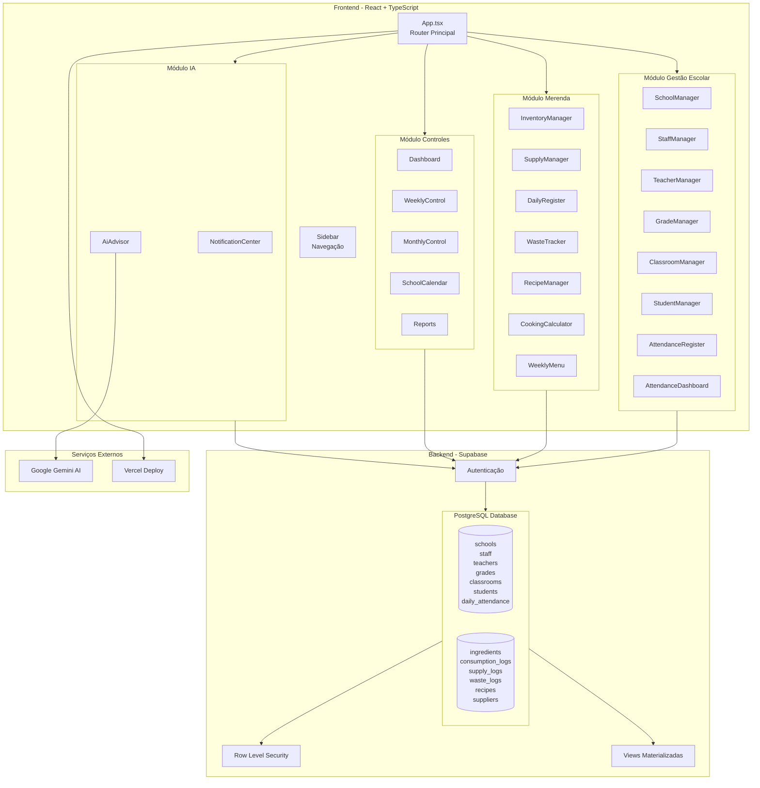
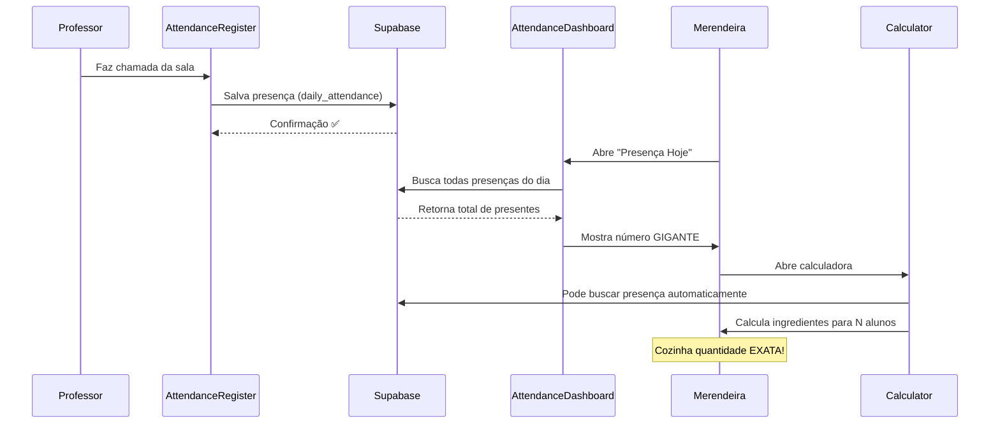
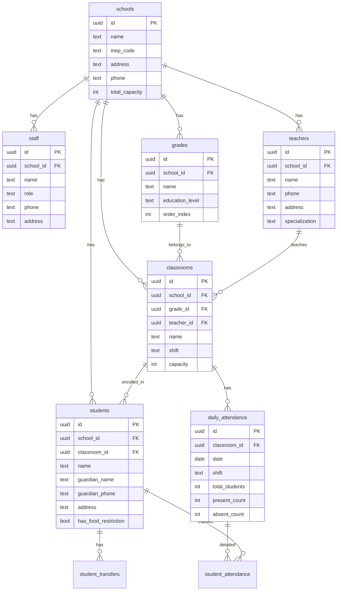
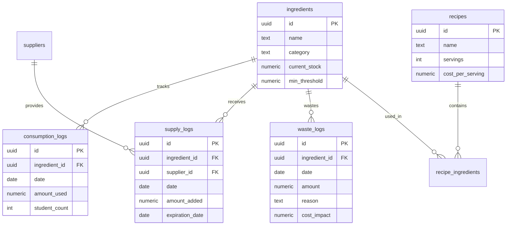
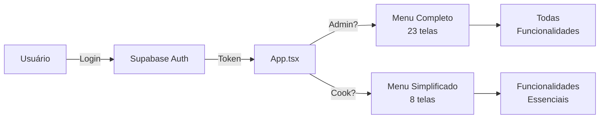

# 🏗️ Arquitetura do Sistema MerendaMonitor

## 📐 Visão Geral da Arquitetura



---

## 🔄 Fluxo de Dados Principal



---

## 🗂️ Estrutura de Banco de Dados

### Módulo Gestão Escolar (9 tabelas)



### Módulo Merenda (8 tabelas)



---

## 🔐 Fluxo de Autenticação



---

## 📱 Componentes e Responsabilidades

### Layer 1: Entrada de Dados
- **StudentManager** - CRUD de alunos
- **TeacherManager** - CRUD de professores
- **ClassroomManager** - CRUD de salas
- **SupplyManager** - Entrada de mercadorias
- **AttendanceRegister** - Registro de presença

### Layer 2: Processamento
- **services/analytics.ts** - Cálculos estatísticos
- **services/forecasting.ts** - Previsões de estoque
- **services/notifications.ts** - Geração de alertas

### Layer 3: Visualização
- **AttendanceDashboard** - Presença em tempo real
- **Dashboard** - Visão geral
- **WeeklyControl** - Análise semanal
- **MonthlyControl** - Análise mensal

### Layer 4: Saída
- **Reports** - Relatórios PDF/Excel
- **NotificationCenter** - Alertas
- **AiAdvisor** - Insights com IA

---

## 🎯 Pontos de Integração Críticos

### 1. Presença → Merenda

```typescript
// AttendanceDashboard busca presença
const totalPresent = attendances.reduce((acc, a) => acc + a.presentCount, 0);

// Merendeira usa este número
// CookingCalculator pode auto-preencher com este valor
```

### 2. Alunos com Restrições → Notificações

```typescript
// Sistema alerta merendeira sobre restrições alimentares
students.filter(s => s.hasFoodRestriction)
  .forEach(student => {
    // Gera notificação especial
  });
```

### 3. Calendário Escolar → Previsões

```typescript
// Previsões consideram apenas dias letivos
const schoolDays = calendar.filter(day => day.isSchoolDay);
const prediction = calculateForSchoolDays(schoolDays);
```

---

## 🔧 Stack Tecnológico

### Frontend
- **React 19** - UI Framework
- **TypeScript 5** - Type Safety
- **Vite 6** - Build Tool
- **Tailwind CSS** - Estilização
- **Lucide React** - Ícones
- **Recharts** - Gráficos

### Backend
- **Supabase** - BaaS (Backend as a Service)
  - PostgreSQL 15
  - Row Level Security
  - Real-time subscriptions
  - Authentication

### External Services
- **Google Gemini AI** - Insights inteligentes
- **Vercel** - Deploy e hosting

### Libraries
- **jsPDF** - Geração de PDF
- **XLSX** - Geração de Excel
- **React Markdown** - Renderização de IA

---

## 📏 Métricas do Sistema

### Código
- **23** Componentes React
- **30+** Interfaces TypeScript
- **17** Tabelas no banco
- **~6.000** linhas de código

### Funcionalidades
- **23** Telas para Admin
- **8** Telas para Merendeira
- **4** Módulos principais
- **2** Scripts SQL

### Performance
- **<2s** Carregamento inicial
- **<500ms** Navegação entre telas
- **<1s** Salvamento de dados
- **Auto-refresh** a cada 5min no dashboard de presença

---

## 🎨 Design System

### Cores por Módulo
- 🟢 **Verde (Emerald)** - Base/Sidebar
- 🔵 **Azul** - Gestão de Alunos
- 🟣 **Roxo** - Professores
- 🟠 **Laranja** - Merenda/Cozinha
- 🟡 **Amarelo** - Alertas
- 🔴 **Vermelho** - Crítico/Desperdício
- 🔷 **Índigo** - Salas e Gestão

### Padrões de UI
- **Cards com gradiente** para headers importantes
- **Estatísticas em destaque** com números grandes
- **Badges coloridos** para status
- **Progress bars** para ocupação
- **Modais** para formulários complexos
- **Alertas contextuais** com ícones

---

## 🔮 Roadmap Futuro

### Fase 1 (Atual) ✅
- Gestão escolar completa
- Sistema de presença
- Controles de merenda

### Fase 2 (Próxima)
- App mobile para professores
- Push notifications
- Presença individual (nome por nome)
- QR Code para alunos

### Fase 3 (Futura)
- Multi-escola
- Dashboard consolidado
- Transferências entre escolas
- Relatórios nutricionais avançados

---

**Sistema arquitetado para escalar e evoluir! 🚀**
