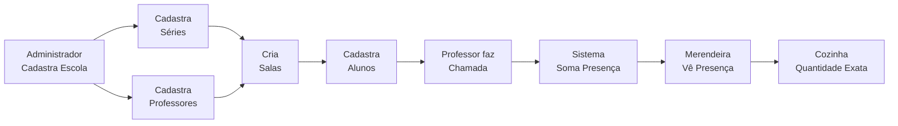

# 🏫 Guia Completo: Gestão Escolar + Merenda Integrada

## 🎯 Visão Geral

O MerendaMonitor agora é um **sistema completo de gestão escolar** com controle de presença em tempo real integrado à merenda. A merendeira não precisa mais adivinhar quantos alunos cozinhar - o sistema mostra a presença REAL do dia!

---

## 🚀 Como Funciona o Fluxo Completo



---

## 📋 Passo a Passo de Implementação

### Etapa 1: Executar Scripts SQL

Execute os scripts na seguinte ordem no **SQL Editor** do Supabase:

1. `scripts/add_new_features.sql` - Funcionalidades de merenda
2. `scripts/setup_school_management.sql` - Gestão escolar

### Etapa 2: Configuração Inicial (Admin)

#### 1️⃣ Cadastrar a Escola
**Menu:** Gestão Escolar → Dados da Escola

Preencha:
- Nome da escola
- Código INEP
- Endereço completo
- Telefone e e-mail
- Capacidade total

#### 2️⃣ Cadastrar Séries
**Menu:** Gestão Escolar → Séries

Crie as séries da escola:
- Pré-escola
- 1º Ano, 2º Ano, 3º Ano... até onde sua escola atende
- EJA (se houver)

#### 3️⃣ Cadastrar Professores
**Menu:** Gestão Escolar → Professores

Cadastre todos os professores com:
- Nome completo
- CPF e matrícula
- Endereço e telefone
- Especialização
- Data de contratação

#### 4️⃣ Cadastrar Direção/Coordenação
**Menu:** Gestão Escolar → Direção

Cadastre:
- Diretor(a)
- Coordenadores
- Supervisores

#### 5️⃣ Criar Salas/Turmas
**Menu:** Gestão Escolar → Salas/Turmas

Para cada sala:
- Nome (ex: "Sala 1A", "Turma Azul")
- Série
- Professor responsável
- Capacidade
- Turno (Manhã/Tarde/Noite/Integral)

#### 6️⃣ Cadastrar Alunos
**Menu:** Gestão Escolar → Alunos

Para cada aluno:
- Nome completo
- Data de nascimento
- Endereço
- Nome do responsável (obrigatório)
- Telefone do responsável (obrigatório)
- Sala/Turma
- Restrições alimentares
- Necessidades especiais

---

## 🔄 Fluxo Diário de Operação

### Para Professores/Coordenadores

**⏰ Horário: Assim que as aulas começam (07:30 - 08:30)**

1. Acesse: **Gestão Escolar → Fazer Chamada**
2. Selecione sua sala
3. Digite quantos alunos estão presentes
4. Adicione observações se necessário
5. Clique em "Confirmar Presença"

### Para a Merendeira

**⏰ Horário: Antes de começar a cozinhar (08:30 - 09:00)**

1. Acesse: **📊 Presença Hoje** (primeira opção do menu)
2. Veja o número GIGANTE em laranja - esse é o número de alunos presentes
3. Verifique se todas as salas já registraram (alerta verde)
4. Use esse número na Calculadora de Merenda
5. Cozinhe a quantidade exata!

**🎯 Vantagem:** Não tem mais desperdício por cozinhar demais ou falta de comida!

---

## 📊 Telas Principais

### 1. Dashboard de Presença (Merendeira)
**Acesso:** 📊 Presença Hoje

**O que mostra:**
- ⭐ **NÚMERO GIGANTE**: Quantos alunos estão na escola AGORA
- Total de matriculados
- Taxa de presença (%)
- Divisão por turno (manhã/tarde/noite)
- Status: Todas salas registraram? ✅ ou ⚠️
- Botão de atualizar em tempo real

**Como usar:**
- Abra essa tela TODO DIA antes de cozinhar
- Clique em "Atualizar" para pegar os dados mais recentes
- Use o número mostrado na calculadora

### 2. Registro de Chamada (Professores)
**Acesso:** Fazer Chamada

**O que mostra:**
- Lista de todas as salas
- Formulário rápido para cada sala
- Status: Já registrou hoje? ✅ ou ❌
- Possibilidade de editar depois

### 3. Gestão de Alunos
**Acesso:** Gestão Escolar → Alunos

**Funcionalidades:**
- Cadastro completo de alunos
- Vincular a uma sala
- Registrar restrições alimentares (importante!)
- Registrar necessidades especiais
- Dados do responsável
- Filtros: por sala, por status, busca por nome
- Estatísticas: total, ativos, com restrições

### 4. Gestão de Salas
**Acesso:** Gestão Escolar → Salas/Turmas

**Funcionalidades:**
- Criar salas/turmas
- Vincular série e professor
- Definir capacidade
- Escolher turno
- Ver ocupação em tempo real
- Cards visuais com barra de progresso

### 5. Gestão de Professores
**Acesso:** Gestão Escolar → Professores

**Funcionalidades:**
- Cadastro completo
- Endereço e telefone
- Especialização
- Data de contratação
- Status ativo/inativo

---

## 🎨 Recursos Visuais Inovadores

### Cores por Seção
- 🟢 **Verde**: Presença confirmada
- 🟠 **Laranja**: Merendeira/Cozinha
- 🔵 **Azul**: Alunos e gestão escolar
- 🟣 **Roxo**: Professores
- 🔴 **Vermelho**: Alertas e ausências

### Indicadores Visuais
- ✅ Check verde: Tudo OK
- ⚠️ Atenção: Falta ação
- 📊 Estatísticas em destaque
- 🎯 Número gigante de presença

---

## 🔐 Controle de Acesso

### Admin (Nutricionista/Gestor)
- ✅ Acesso total
- ✅ Cadastros de escola, professores, alunos
- ✅ Visualização de presença
- ✅ Todos os relatórios

### Cozinha (Merendeira)
- ✅ Ver presença do dia
- ✅ Fazer chamada (se autorizada)
- ✅ Calculadora de merenda
- ✅ Registro de consumo
- ⛔ Sem acesso a cadastros

---

## 📈 Relatórios com Presença

Os relatórios agora podem incluir:
- Taxa de presença média do período
- Comparativo: alunos matriculados vs presentes
- Análise de desperdício baseado em presença
- Custo por aluno presente (não apenas matriculado)

---

## 🎯 Casos de Uso Reais

### Caso 1: Dia Normal
```
08:00 - Professores fazem chamada
08:30 - Sistema mostra: 387 alunos presentes (de 450 matriculados)
09:00 - Merendeira vê o número e cozinha para 387
Resultado: Zero desperdício, todos comem
```

### Caso 2: Dia de Chuva
```
08:00 - Professores fazem chamada
08:30 - Sistema mostra: 210 alunos presentes (muitas faltas)
09:00 - Merendeira cozinha menos
Resultado: Economia de ingredientes, menos desperdício
```

### Caso 3: Dia de Evento
```
No calendário escolar foi marcado: "Gincana - Presença 120%"
Sistema ajusta previsão automaticamente
Merendeira se prepara para mais alunos
```

---

## 🆘 Troubleshooting

### "Não aparece nenhum aluno"
- Verifique se executou o SQL
- Confirme que os alunos foram cadastrados em salas
- Verifique se a sala está ativa

### "Presença não atualiza"
- Clique no botão "Atualizar"
- Verifique a data selecionada
- Confirme que os professores fizeram a chamada

### "Não consigo cadastrar aluno"
- Verifique se a série existe
- Verifique se a sala existe
- Campos obrigatórios: Nome, Responsável, Telefone

---

## 📱 Próximas Funcionalidades (Futuras)

- App mobile para professores fazerem chamada
- Notificação automática para merendeira quando todas as salas registrarem
- Histórico de presença por aluno
- Relatórios de frequência
- Integração com sistema de notas
- QR Code para alunos marcarem presença

---

## 🎉 Benefícios do Sistema

### Para a Escola
✅ Controle total de alunos e professores  
✅ Relatórios de frequência automáticos  
✅ Gestão organizada de salas  

### Para a Merendeira
✅ Sabe EXATAMENTE quantos alunos cozinhar  
✅ Reduz desperdício drasticamente  
✅ Evita falta de comida  
✅ Economia de ingredientes  

### Para a Administração
✅ Dados precisos para prestação de contas  
✅ Controle de custo real por aluno presente  
✅ Análises de frequência escolar  
✅ Integração total merenda + presença  

---

## 🔧 Arquivos Criados

**SQL:**
- `scripts/setup_school_management.sql`

**Tipos:**
- `types-school.ts`

**Componentes (8 novos):**
1. `SchoolManager.tsx` - Dados da escola
2. `StaffManager.tsx` - Direção/Coordenação
3. `TeacherManager.tsx` - Professores
4. `GradeManager.tsx` - Séries
5. `ClassroomManager.tsx` - Salas/Turmas
6. `StudentManager.tsx` - Alunos
7. `AttendanceRegister.tsx` - Registro de presença
8. `AttendanceDashboard.tsx` - Dashboard para merendeira

**Atualizados:**
- `App.tsx` - Integração das rotas
- `Sidebar.tsx` - Menu organizado por seções

---

## 💡 Dicas de Ouro

1. **Cadastre na ordem**: Escola → Séries → Salas → Professores → Alunos
2. **Faça a chamada TODO DIA**: Assim a merenda fica perfeita
3. **Use o Dashboard de Presença**: É a tela mais importante para a merendeira
4. **Marque restrições alimentares**: O sistema lembrará automaticamente
5. **Mantenha dados atualizados**: Transfira alunos de sala quando necessário

---

**Sistema pronto para revolucionar a gestão da sua escola! 🚀**
